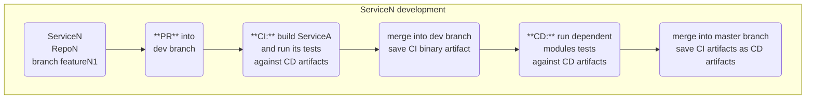

[]()
# Guide to C++ API changes in microservice architecture

Table of contents:

[Motivation](#motivation)  
[Microservices - short intro](#microservices---short-intro)  
[Goals](#goals)  
[Why not C APi?](#why-not-c-api)  
[gcc pre-C++11 ABI and C++11 ABI support](#gcc-pre-c11-abi-and-c11-abi-support)  
[Names visibility](#names-visibility)  
[Cases of possible changes and ways to introduce them:](#cases-of-possible-changes-and-ways-to-introduce-them)  
&nbsp;&nbsp;[1. a new function argument](#1-a-new-function-argument-source-diff)  
&nbsp;&nbsp;[2. a new struct member](#2-a-new-struct-member-and-a-function-that-takes-it-as-an-argument-source-diff)  
&nbsp;&nbsp;[3. changes in inline parts](#3-changes-in-inline-parts-source-diff)  
&nbsp;&nbsp;[4. inline classes and non-inline functions that use them](#4-inline-classes-and-non-inline-functions-that-use-them-source-diff)  
&nbsp;&nbsp;[5. exposing internal classes](#5-exposing-internal-classes-source-diff)  
&nbsp;&nbsp;[6. enumerations](#6-enumerations)  
&nbsp;&nbsp;[7. breaking changes](#7-breaking-changes)  
[Conclusion](#conclusion)

## Motivation
Assume you have a C++ library that is used by other modules. The library provides a simple API:
```cpp
struct S{
  int a;
}; 
void f(S const & s);
```
Suppose you modify the structure `S` by adding a new member. While the library’s own tests pass, some previously built binaries that depend on the function `f` begin to crash. Why is this happening? You've unintentionally broken the binary interface (ABI) of your library, which requires all dependent modules to be recompiled to function correctly. But what if you need to ensure backward binary compatibility? This article will guide you through the process.

## Microservices - short intro
Let’s review a simple CI/CD pipeline for two microservices: ServiceA and ServiceB. Assume that ServiceA is independent, while ServiceB depends on ServiceA. To keep our CI pipeline efficient, we only run tests for the service that has been modified. However, during the CD stage, we run tests for all dependent services. In this article, we use terms `service` and `module` interchangeably.




ServiceA source code file structure:
```
├── include
│   └── A
│       └──api.hpp
├── src
│   └── api.cpp
├── tests
│   └── test.cpp
└── ...
```
`include/A/api.hpp`:
```cpp
namespace a{
struct params{
    std::string name;
};
void init(params const & init_params);
void foo();
inline int bar() { return 10; }
}
```
`src/api.cpp`:
```cpp
#include "A/api.hpp"
#include <iostream>
namespace a{
void init(params const & init_params)
{
    std::cout << "hello from init: " << init_params.name << "\n";
}
void foo()
{
    std::cout << "hello from foo\n" ;
}
}
```

ServiceA artifact file structure (for linux):
```
├── include
│   └── A
│       └──api.hpp
├── lib
│   └── lib/libA.so
├── tests
│   └── testA
└── ...
```
ServiceB source code file structure:

src/main.cpp

`tests/testB.cpp`:
```cpp
#include <A/api.hpp>
int main()
{
    a::Params params;
    a::init(params);
    a::foo();
    auto v = a::bar();
    return  v / 2;
}
```

## Goals:
1. Backward compatibility must be both at API and ABI level.  
*if we naively change `void foo();` to `void foo(int arg = 0);` we break ABI compatibility only. CI tests will pass and CD tests will fail to start because ServiceB expects `f()` in libA.so.* 

2. API header should be clean and contain only one name for a function (preferably without a version suffix)  

### Why not C API?
Many developers avoid C++ APIs due to past issues with name mangling and ABI instability. For example, on Linux, `std::string` and `std::list` changes in C++11 caused problems, and on Windows, Visual C++ introduced new name mangling schemes with each version. However, since 2015, C++ ABI and name mangling have become quite stable. While bugs can still occur, you can opt for a C API using [the hourglass api pattern](https://github.com/JarnoRalli/hourglass-c-api) for extra safety. In practice, though, this approach often results in more support work to avoid some headaches in case of a bug in your compiler. In my view, the effort outweighs the benefit, as it only addresses one specific type of compiler issues. But if you prefer to be on the safe side, consider using C function names with versions (e.g., `foo` -> `foo_v1` -> `foo_v2`) with an inline C++ API layered on top (see [the hourglass api pattern](https://github.com/JarnoRalli/hourglass-c-api)).

### gcc pre-C++11 ABI and C++11 ABI support
if your library is used by both pre-C++11 ABI and C++11 ABI clients - [here is a guide for pre-C++11 ABI and C++11 ABI support](./abi0.md)


### Names visibility
For simplicity in our examples, we assume all symbols have default visibility (i.e., symbol names are stored in the binary and available at runtime for name resolution). In practice, however, only public API symbols should be visible, and they should be explicitly marked as such. see [Introduction to symbol visibility](https://developer.ibm.com/articles/au-aix-symbol-visibility/).

## Cases of possible changes and ways to introduce them:
### 1. a new function argument ([source diff](https://github.com/alex-176/cpp_lib_updates/commit/00a9c279a11014490dfb25e94a5df733687cf100))
Change the function signature by adding a new argument with a default value and define an old function that calls a new one:

`include/A/api.hpp`:
```cpp
namespace a{
    // ....
    void foo(int arg = 0); 
}
```
`src/api.cpp`:
```cpp
#include <A/api.hpp>
#include <iostream>
namespace a{
void foo(int arg)
{
    std::cout << "foo() arg: " << arg << "\n"; 
}
// add old function implementation that calls a new one or keep an old implementation if necessary
void foo()
{
    foo(0);
}
}
```

Now ServiceA exports both `foo()` and `foo(int)`, but only `foo(int)` is exposed in the header. So after the next recompilation of ServiceB, it will start using `foo(int)`.

### 2. a new struct member and a function that takes it as an argument ([source diff](https://github.com/alex-176/cpp_lib_updates/commit/8e4a6ef8a1cc3e081f0db2527d29fa7a9a4bd402))
Inline namespaces come to rescue.

[Inline namespaces](https://en.cppreference.com/w/cpp/language/namespace#Inline_namespaces) exist since C++11. They don't change the way the client code looks but change compiler-generated mangled names inside inline namespace (usually by adding a namespace name to the generated names). [example on godbolt](https://godbolt.org/z/WsGM5TKe5)

The idea is to place the old implementation within an old inline namespace in a `.cpp` file, and the new implementation within a new inline namespace. This allows old clients to resolve the old names at runtime, while clients that are recompiled will use the new names.

`include/A/api.hpp`:
```cpp
namespace a{
// add inline namespace with a version for the changed part:
inline namespace v_1{
struct params{ // this name 
    std::string name;
    int age = 10;
};
void init(params const & _params);
}
// ...
}
```
`src/api.cpp`:
```cpp
#include <A/api.hpp>
#include <iostream>
namespace a{
inline namespace v_1{
void init(params const & _params)
{
    std::cout << "init() name: " << _params.name << " age: " << _params.age << "\n";
}
}}
```
Add another file that implements translation from the old struct into the new one. This way we provide binary compatibility for old clients.

`src/api_compatibility.cpp`:
```cpp
#include <A/api.hpp>
namespace a{
// provide old definition in the old version namespace
struct params{
    std::string name;
};
// function in old namespace fills up new struct and calls new function
void init(params const & init_params)
{
   v_1::params new_params;
   new_params.name = init_params.name;
   init(new_params);
}
}
```
### 3. changes in inline parts ([source diff](https://github.com/alex-176/cpp_lib_updates/commit/62459f5a9c29e91eac314cd925a2338d5ec68f97))
Inline functions are not always inlined into compiled code. It means if several modules have an implementation of an inline function, only one of them will be used by the loader. For example:

lib1 defines: `inline int bar() { return 10; }`

lib2 defines: `inline int bar() { return 20; }`

An app is using both lib1 and lib2. if `bar` was not inlined (it's possible) then loader will resolve both bar functions to point to one of them. it violates [ODR](https://en.cppreference.com/w/cpp/language/definition). To fix it we reside the inline code inside its own inline namespace and in case of any change we update the name of the inline namespace:

`include/A/api.hpp`:
```cpp
namespace a{
// ...
// all the inline code is under inline namespace. its name must be changed for each change in any of the inline function 
inline namespace inline_code_v_1{
inline int bar() { return 10; }
// other inline functions, classes etc.
}}
```
### 4. inline classes and non-inline functions that use them ([source diff](https://github.com/alex-176/cpp_lib_updates/commit/66f6167348f1a3e48cbe0b5ffbda90c9c72a0737))
Assume we have a none-inline free function that accepts an inline class as an argument. The function is using only a small part of the class.

`include/A/api.hpp`:
```cpp
namespace a{
class inline_class_1{/*...*/};
class inline_class_2{/*...*/};

// inline class that is used by a non-inline function 
class some_class{
   public:
   some_class(int arg1, int arg2) {/*...*/}
   void f1() { /*...*/}
   void f2() { /*...*/}
   void f3() { /*...*/}
   void f4() { /*...*/}
   private:
   inline_class_1 memeber1;
   inline_class_2 memeber2;
};
// non-inline function that uses inline some_class.
// use_some_class is using f1 and f2 methods only 
void use_some_class(some_class & arg);
}
```
We have non-inline `use_some_class()` ([case 2.](#2-a-new-struct-member-and-a-function-that-takes-it-as-an-argument)) that depends on inline part - `some_class` ([case 3.](#3-changes-in-inline-parts)). `use_some_class()` is using a small part of `some_class` - `f1()` and `f2()` methods. In this case the concept of inline changes (just update its namespace name) does not fit well because any update of `some_class` or inline parts it depends on (`inline_class_1`, `inline_class_2`) causes a version update of non-inline `use_some_class()`. One possible approach is to extract functionality used by non-inline functions into an interface and place this interface within the namespace of the corresponding non-inline functions.

`include/A/api.hpp`:
```cpp
namespace a{
class some_class_interface{
   public:
   virtual void f1() = 0;
   virtual void f2() = 0;
};
// non-inline function that uses some_class_interface that exposes f1 and f2 only  
void use_some_class(some_class_interface & arg);

inline namespace inline_code_v_1{

class inline_class_1{/*...*/};
class inline_class_2{/*...*/};

// inline class that can be freely modified without touching the versioning of use_some_class 
class some_class : public some_class_interface{
   public:
   some_class(int arg1, int arg2) {/*...*/}
   void f1() override { /*...*/}
   void f2() override { /*...*/}
   void f3() { /*...*/}
   void f4() { /*...*/}
   private:
   inline_class_1 member1;
   inline_class_2 member2;
};
}}
```
### 5. exposing internal classes ([source diff](https://github.com/alex-176/cpp_lib_updates/commit/9b5473b09f279d2543e67939041e3ab62e99baf7))
Suppose your API has a function that creates an internal object, and you want to expose this object in the API. `std::shared_ptr` and forward declarations can help achieve this. This approach hides internal class changes from users while ensuring that all users interact with the same version of the internal class at runtime. If you need to expose your internal class as a real class with methods, consider adding a wrapper class alongside the free functions API. Since this wrapper class is inline, it should adhere to the guidelines outlined in [case 3.](#3-changes-in-inline-parts)

`include/A/api.hpp`:
```cpp
#include <memory>
namespace a{
// use forward declaration + shared_ptr
class internal_class;
using internal_class_sptr = std::shared_ptr<internal_class>;

// provide a function that instantiates an object of internal_class
internal_class_sptr create_internal_class_instance(int value);
// provide functions that redirect calls to internal_class methods
int get_value(internal_class_sptr class_ptr);

// If you want to expose the functionality as a class
// provide a class that redirects calls to free functions
inline namespace inline_code_v_1{
class exposed_internal_class{
public:
    exposed_internal_class(int value) : _impl(a::create_internal_class_instance(value)){}
    int get_value() { return get_value(_impl); } // redirect call to a free function
private:
    internal_class_sptr  _impl;
};
}}
```
`src/api.cpp`:
```cpp
#include "A/api.hpp"
namespace a{

// internal_class definition 
class internal_class { 
public:
    int get_value() { return 5; }; 
};

int get_value(internal_class_sptr class_ptr){
    return class_ptr->get_value();
}
}
```
### 6. enumerations
By default, the size of enum depends on the range of its values. To prevent the size of an enum type from changing, specify an underlying type (e.g. `uint32_t`). The only modification that will maintain backward compatibility is adding new values to the enum.
```cpp
namespace a{ 
enum class Enum : uint32_t{
   value0, // old value
   value1, // old value
   value2 // a new value 
};
}
```
### 7. breaking changes
Examples of breaking changes: 
* deleting a struct member
* changing a struct member type
* changing a function parameter type, leading to an ambiguous overload resolution
* changing an existing enumeration value

In some cases, breaking changes are inevitable. Unfortunately, C++ doesn't offer a direct solution for handling them smoothly. The only effective approach is to modify both the library and all dependent modules, ensuring that your CI/CD pipeline supports the simultaneous promotion of multiple repositories.
  
## Conclusion
There are strategies for evolving C++ APIs in microservices without breaking ABI compatibility. The most important are inline namespaces, careful managing function signatures, and using shared pointers. There are still breaking changes that require simultaneous changes in multiple repositories but hopefully, it will be a rare case. 

## Resources & Links

- [Original Article & Code Examples](https://github.com/alex-176/cpp_lib_updates)
- [Inline Namespaces Reference](https://en.cppreference.com/w/cpp/language/namespace#Inline_namespaces)
- [Hourglass API Pattern](https://github.com/JarnoRalli/hourglass-c-api)
- [Symbol Visibility Guide](https://developer.ibm.com/articles/au-aix-symbol-visibility/)
- [ABI compliance checker](https://lvc.github.io/abi-compliance-checker/)