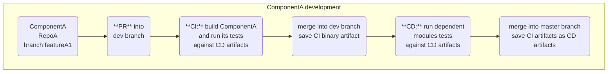
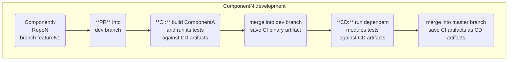

---
# global part
# You can also start simply with 'default'
theme: seriph

title: C++ API changes 
info: C++ changes in component-based architecture 

# https://sli.dev/features/drawing
drawings:
  persist: false
# slide transition: https://sli.dev/guide/animations.html#slide-transitions
transition: fade
# enable MDC Syntax: https://sli.dev/features/mdc
mdc: true

addons:
    - slidev-component-progress

# first slide part
background: ./cpp_microservices.webp

# apply "all text in the center" style to the first silde
class: text-center
hideInToc: true
---

<style>  h1 { text-align: center; } </style>


# C++ API Changes in Component-Based Architecture
#### A practical guide for maintaining ABI/API module compatibility

---

# Component-Based Architecture (CBA)

## **CBA** is a design that emphasizes reusable software components

<br>

- Components interact by their public interfaces (API)
- Components are built and tested independently
- Once a component passed its own tests, CD executes dependent components tests  
- Dependent components are prebuilt with an old version of the changed component 

<br>




---

# Our Goal - Backward Compatibility 

<br>

### **API Level**: 
### Modules using our API compile without modification with the updated API 
<br>

### **ABI Level**: 
### Binary modules built against a previous version of our API work with the updated binary of our module.

<br>

### **Clean API**: 
### API should stay clean and easy to use.


---
layout: two-cols-header
layoutClass: gap-6
---

# The Problem - API compatible changes break ABI

#### if we modify `S` structure by adding a new member, the library’s own tests pass, but previously built binaries that call  `foo` start to crash

::left::

```cpp
// Version 1 - Your library API
struct S {
  int a;
}; 
void foo(S const & s);
```

::right::

```cpp
// Version 2 - added a new member
struct S {
  int a;
  int b;  // New member added
}; 
void foo(S const & s);
```
<br>

#### **Result**: Previously built binaries crash! 💥
<br>

#### **[ABI Broken = Recompile Everything!]{style="color: #ef4444"}**

<br>
<br>

---
layout: two-cols-header
layoutClass: gap-4
---

# Classical solution - new names

#### API becomes cluttered with old structs or requires changes of all the clients twice

1. library change: add `S_v1`
2. clients change: rename `S` -> `S_v1`

##### if you want to clean up the library and remove S_v1 - all the clients switch to `S_v1`, then in the library make `S` equal to `S_v1` then all the clients switch to `S` again and finally the library can delete `S_v1`     

::left::

```cpp
// Version 1 - Your library API
struct S {
  int a;
}; 
void foo(S const & s);
```

::right::

```cpp  {*|1-5|7-12|*}
// maintain Version 1 API 
struct S {
  int a;
}; 
void foo(S const & s);

// Version 2 API - added a new member
struct S_v1 {
  int a;
  int b;  // New member added
}; 
void foo(S_v1 const & s);
```
<br>
<br>
<br>
<br>

---

# Why not C API? 🤔

<div class="grid grid-cols-2 gap-0">

<div>

## Past Issues 
- Name mangling nightmares
- `std::string`/`std::list` C++11 changes
- Visual C++ version incompatibilities

## C API Benefits
- Rock-solid ABI stability
- Language interoperability

</div>

<div>

## Modern C++ Reality (2015+)
- ✅ Stable ABI and name mangling
<br>
<br>
<br>

## C API Drawbacks
- New function/struct name for each function/struct change<br>
</div>
</div>

<br>

## C++ way
- C/C++ functions API can be accompanied by object-oriented-wrapper API -  [Hourglass pattern](https://github.com/JarnoRalli/hourglass-c-api)
- C++ functions API can benefit from namespaces, templates, constexpr and other C++ features

---
layout: center
class: text-center
---

# USE-CASES

---

# 1. Adding Function Arguments - overloading

 
<div class="grid grid-cols-2 gap-4">

<div>

## Before
```cpp
// api.hpp
namespace a {
    void foo();
}

// api.cpp
namespace a {
void foo() {
    std::cout << "foo()\n"; 
}}
```

</div>

<div>

## After
```cpp {*|1,2,4|1,2,4,7-11|1,2-4,7-11,13-15|*}
// api.hpp  
namespace a {
    void foo(); 
    void foo(int arg); 
}

// api.cpp
namespace a {
void foo(int arg) {
    std::cout << "foo() arg: " << arg << "\n"; 
}

void foo() {
    foo(0);  // Delegate to new version
}}
```

</div>

</div>

**Result**: Library exports both `foo()` and `foo(int)` <br><br>
**Issues**: The change breaks compilation of the client code that takes an address of the function (`&foo`) [(link)](https://godbolt.org/z/1fc3G8ePv)

---

# 1. Adding Function Arguments - default value

<div class="grid grid-cols-2 gap-4">

<div>

## Before
```cpp
// api.hpp
namespace a {
    void foo();
}

// api.cpp
namespace a {
void foo() {
    std::cout << "foo()\n"; 
}}
```

</div>

<div>

## After
```cpp {*|1-3|1-10|*}
// api.hpp  
namespace a {
    void foo(int arg = 0); 
}

// api.cpp
namespace a {
void foo(int arg) {
    std::cout << "foo() arg: " << arg << "\n"; 
}

// Keep old function for ABI compatibility
void foo() {
    foo(0);  // Delegate to new version
}}
```

</div>

</div>

**Result**: Library exports both `foo()` and `foo(int)` - old binaries work, new compiles use the new version. Function address (`&foo`) works as expected.

---
layout: two-cols-header
layoutClass: gap-4
---

# 2. Adding Struct Members - The Problem

#### Adding a struct member preserves API compatibility but breaks ABI compatibility
#### Name mangling stays the same but the actual struct changes. 
#### Prebuilt binaries will load but when `foo` accesses `age` it can crash or get garbage.

::left::
api.hpp
```cpp {*|4}
namespace a {
  struct params {
    std::string name;
    int age = 10;  // New member
  };
  void foo(params const & _params);
}
```
::right::
api.cpp
```cpp {*|4-5}
namespace a {
  void foo(params const & _params) { 
    // if is called from an old binary
    // garbage or crash 
    if (_params.age) { 
      /* ... */ 
    }
  }
}
```
<br><br><br>

---
layout: two-cols-header
layoutClass: gap-6
---

# 2. Versioning - Inline Namespaces

### Inline namespaces change mangled names without changing client code syntax

::left::

#### Without inline namespace 
```cpp
namespace a {
    void foo();  // Mangled as: _ZN1a3fooEv
}


void usage()
{
    
    // compiler inserts a call to _ZN1a3fooEv
    a::foo();
}
```

::right::
#### Adding versioning with `namespace`
````md magic-move {lines: false}
```cpp  {0|*|2|5,10,11,12|2,5}
namespace a {
    namespace v1 {
        void foo();  // Mangled as: _ZN1a3v13fooEv (v1 is part of it)
    }
    using namespace v1;
}

void usage()
{
    // compiler inserts a call to _ZN1a3v13fooEv
    // v1 is a part of the full mangled name
    a::foo();
}
```

```cpp {2|*}
namespace a {
    inline namespace v1 {
        void foo();  // Mangled as: _ZN1a3v13fooEv (v1 is part of it)
    }
}


void usage()
{
    // compiler inserts a call to _ZN1a3v13fooEv
    // v1 is a part of the full mangled name
    a::foo();
}
```
````

<br>
<br>

---
layout: two-cols-header
layoutClass: gap-4
---

# 2. Adding Struct Members - Solution

#### Inline Namespaces : prebuilt clients resolve old names, recompiled clients get new names

::left::

#### Changed API
```cpp {*|3|3,6|3,6,8|3,6,8,14,15|*}
// api.hpp
namespace a {
  inline namespace v1 { // inline namespace with new version
    struct params {
      std::string name;
      int age = 10;  // New member!
    };
    void foo(params const & _params);
  }
}

// api.cpp
namespace a {
  inline namespace v1 {
    void foo(params const & _params) { /* implementation*/}
  }
}
```

::right::

#### Compatibility Layer contains old API
```cpp {0|1|3-6|9,12|9,10,12-14|11,12,15|*} 
// api_compatibility.cpp
namespace a {
  // Old struct definition
  struct params {
    std::string name;
  };


  // Old function is a bridge that
  // 1. converts old params to v1::params
  // 2. calls v1::foo function  
  void foo(params const & old_params) {
    v1::params params;
    params.name = old_params.name;
    foo(params);  // Call new version
  }
}
```

---
layout: two-cols-header
layoutClass: gap-4
---

# 3. Inline Code - The Problem

#### 1. `inline` keyword does not mean the code is always inlined
#### 2. Assume in our case compiler did not inline the functions 
#### 3. if a library is built with default symbols visibility (default on linux) - all the symbols are visible and participate in interposition
<br>

::left::
### inline API change (api.hpp) 
before the change
```cpp
// assume the function is too large for auto-inlining
inline int bar() { return 10; }
```
after the change
```cpp
// assume the function is too large for auto-inlining
inline int bar() { return 20; }
```
::right::

### Libraries Lib1 and Lib2 use api.hpp
<br>

<v-switch>
<template #0>

#### 1. Lib1 was rebuilt with updated api.hpp
#### 2. Lib2 was built with old api.hpp
#### 3. Lib1 and Lib2 are built with default visibility
<br>

**[Question: which bar Lib1 and Lib2 call?]{style="color: #ef4444"}**


</template>

<template #1>

#### 1. We break One Definition Rule (ODR)
#### 2. Loader resolves `bar` address with `bar` from the first loaded binary (e.g. Lib1). 
#### 3. All the binaries use the first loaded `bar`

**[Lib2 gets an unexpected result.]{style="color: #ef4444"}**

</template>
</v-switch>


---

# 3. Inline Code - Solution


## **Rule**:  Update inline namespace name for **ANY** change in inline code to avoid ODR violations
<br>

#### Inline code has its dedicated inline namespace

<br>

```cpp
namespace a {
    // inline namespace name is updated for ANY inline code change
    inline namespace inline_code_v1 {
        inline int bar() { return 10; }
        // All other inline functions, classes etc.
    }
}
```


---

# 4. Inline classes + non-inline functions - The Problem

```cpp
namespace a{
    
  // inline class that is used by a non-inline function 
  struct inline_class_foo{
    void f1() { /*...*/}
    void f2() { /*...*/}
    void f3() { /*...*/}
  private:
    /* members */;
  };
  // use_foo is using f1 and f2 methods only 
  void use_foo(inline_class_foo & arg);
}
```

<span class="text-red-500 font-bold text-l"> Any change in `inline_class_foo` can break ABI and `use_foo`. </span>

##### We cannot use `inline_code_v_1` inline namespace for inline code because it's used in non-inline function.


---

# 4. Inline classes + non-inline functions - Solution

### An interface extraction provides separation b/w inline and non-inline parts.

```cpp {*|1-5|1-7|9-|*}
// The interface and the function are in non-inline part
struct foo_interface {
    virtual void f1() = 0;
    virtual void f2() = 0;
};

void use_foo(foo_interface & arg);

// inline part is isolated and can be changed independently
inline namespace inline_code_v1 {
    struct inline_class_foo : public foo_interface {
        // class internals can be freely changed       
        void f1() override { /*...*/ }
        void f2() override { /*...*/ }
        void f3(); // other methods
    private:
        /* members */;        
    };
}
```

---
layout: two-cols-header
layoutClass: gap-4
---

# 5. Enumerations

#### The size of `enum` depends on its values. Specifying an underlying type fixes its size.
#### The only modification that provides backward compatibility is adding new values to `enum`.

::left::

## ❌ Dangerous
```cpp
// Size depends on number of values
enum class Status {
    OK,       // old value
    ERROR,    // old value
    NEW_VALUE // new value - can break ABI
};
```

::right::

## ✅ Safe
```cpp
enum class Status : uint32_t {
    OK,       // old value
    ERROR,    // old value  
    NEW_VALUE // new value - safe to add
};
```
<br>
<br>
<br>
<br>
<br>

---
layout: two-cols-header
layoutClass: gap-4
---

# 6. Exposing Internal Classes

#### If we want to change an internal class - it must not be exposed to users.
#### If we have to expose it - use forward declaration + `std::shared_ptr` and free functions API
::left::

## Free functions API
```cpp {*|1-3|5-6|8-|*}
// Forward declaration + shared_ptr
class internal_class;
using internal_class_sptr = std::shared_ptr<internal_class>;

// Factory function
internal_class_sptr create_internal_class_instance();

// Free functions API
// returns ptr->get_value()
int get_value(internal_class_sptr ptr);
```

::right::

## Class Wrapper (optional)
```cpp {0|}
inline namespace inline_code_v1 {

  struct exposed_internal_class {
    exposed_internal_class() 
    : _impl(create_internal_class_instance()) 
    {}
        
    int get_value() { 
      return get_value(_impl); 
    }
    
  private:
    internal_class_sptr _impl;
  };
}
```

---
layout: two-cols-header
layoutClass: gap-4
---

# 7. Interfaces with virtual methods

### Virtual methods add compile-time and runtime coupling.
### Virtual methods cannot be deleted or changed.
### The only allowed change - adding a new virtual method after the last one.


::left::
```cpp
struct foo_interface{
  virtual void foo() = 0;
  virtual void bar() = 0;
}
```

::right::

```cpp
struct foo_interface{
  virtual void foo() = 0;
  virtual void bar() = 0; 
  virtual void foo(int arg) = 0;
}
```

<br>
<br>
<br>
<br>
<br>

---
layout: two-cols-header
layoutClass: gap-4
---

# 8. Breaking Changes

## Sometimes You Can't Avoid Them

<br>

::left::

### Examples of Breaking Changes
<br>

- Deleting struct members
- Changing member types  
- Modifying existing enum values

::right::
### Possible Approaches
<br>

- Use _v1 suffix approach if possible  
- Modify library AND all dependents<br>
   \+ Coordinate deployment across repos<br>
- Use feature flags if applicable

<br><br><br><br><br><br>

---

# 8. Dual ABI (pre-C++11 and C++11) - The Problem

<div class="mt-8 p-4 text-2xl ">

- PyTorch plugins use pre-C++11 ABI
- Other binaries use C++11 ABI
- Need one library for both PyTorch and other binaries
- C++11  changed `std::string` and `std::list` layout and broke ABI

</div>

---
 
# 9. Dual ABI - `std::string` solution

### Use `std::string_view` for input arguments and a string_wrapper for returns

```cpp {*|1-2|3-10|12-}
// use string_view for IN arguments
void foo(std::string_view arg);

// use string_wrapper for OUT arguments
struct string_wrapper {
    string_wrapper(std::string_view str) : _buffer(str.begin(), str.end()); {}      
    std::string_view str() const         { return std::string_view(_buffer.data(), _buffer.size()); }
private:
    std::vector<char> _buffer;  // ABI-neutral storage
};

// return a string wrapper in ABI-neutral implementation
string_wrapper getNameAN();

// place a regular function into a special namespace 
inline namespace INLINE_NAMESPACE_NAME{
    std::string getName(){
      return std::string(getNameAN().str());
    }
}
```

---

# 9. Dual ABI - other notes

### Use different inline namespaces for different ABIs 

```cpp
#if _GLIBCXX_USE_CXX11_ABI == 0
#  define INLINE_NAMESPACE_NAME inline_code_pre_cxx11_abi
#else
#  define INLINE_NAMESPACE_NAME inline_code
#endif
```

<br>

### Make sure `filename`, `regex` and other `std` symbols that use `std::string` have hidden visibility
add file `hide_symbols.map`
```c
{
  local:
    *filesystem*;
    *regex*;
};
```
use `-Wl,--version-script=hide_symbols.map` gcc command line parameter to pass the script to the linker.

---
layout: two-cols-header
layoutClass: gap-4
---

# Testing ABI Compatibility

::left::
## Automated Testing
- Build old version of library
- Build test client against old version  
- Test client against new library binary
- Should work without recompilation

## CI/CD Integration
- Store ABI snapshots in CI
- Automated ABI comparison on each change
- Break build on unexpected ABI changes

::right::
## Tools
- `abi-compliance-checker`: Compare ABI between versions
- `nm` / `objdump`: Inspect symbol tables
- `ldd`: Check runtime dependencies

---
layout: two-cols-header
layoutClass: gap-4
---

# Common Pitfalls ⚠️

::left::

## "Safe" Changes That Aren't
<br>

- Reordering struct members
- Changing enum underlying type
- Adding virtual functions in the middle

::right::

## Build System Issues
<br>

- Different compiler flags between versions
- Symbol visibility changes

<br>
<br>
<br>
<br>
<br>
<br>
<br>

---

# Takeaways

<br>

<div class="space-y-4">

### 1. Use inline namespaces for your API
### 2. Inline functions/classes should be in their own namespace
### 3. Design APIs with future changes in mind
### 4. Only API symbols should be visible and all the rest should be hidden

</div>

---

# Resources & Links
<br>
<br>


- [Original Article & Code Examples](https://github.com/alex-176/cpp_lib_updates)
- [Inline Namespaces Reference](https://en.cppreference.com/w/cpp/language/namespace#Inline_namespaces)
- [Hourglass API Pattern](https://github.com/JarnoRalli/hourglass-c-api)
- [Symbol Visibility Guide](https://developer.ibm.com/articles/au-aix-symbol-visibility/)
- [ABI compliance checker](https://lvc.github.io/abi-compliance-checker/)

<div style="text-align: center">

 {style="display: inline;" width="150px"}
</div>